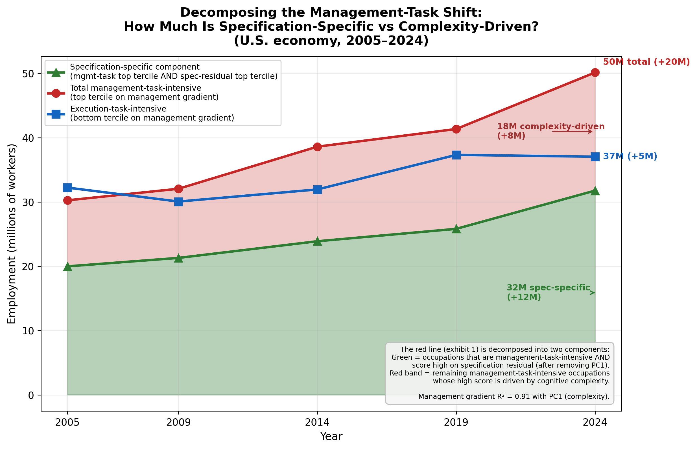
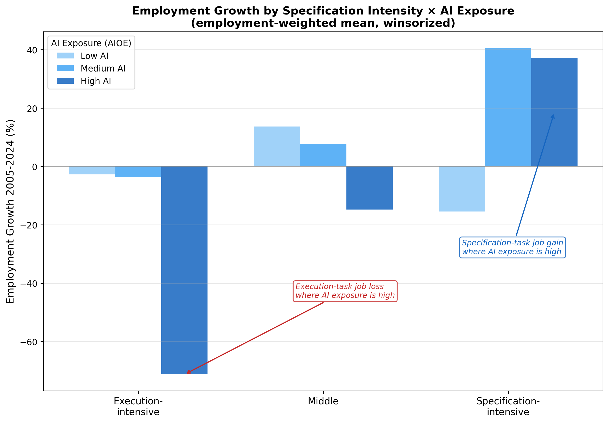
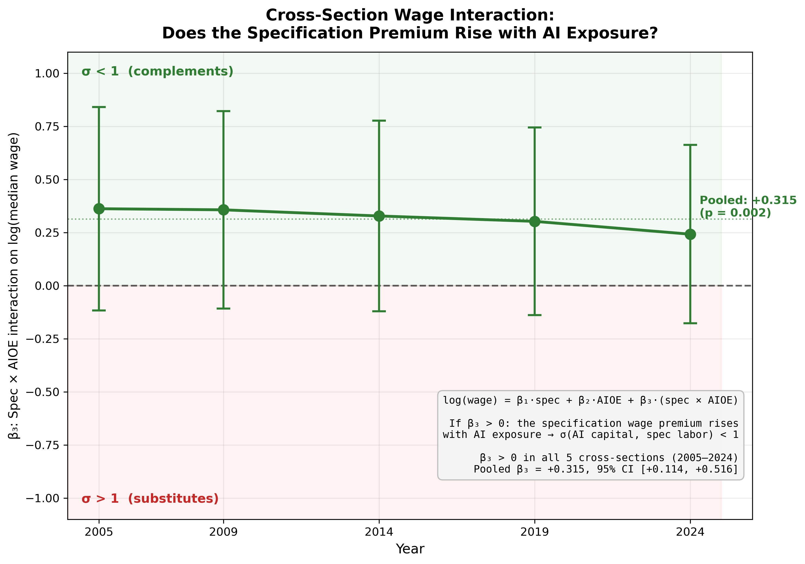
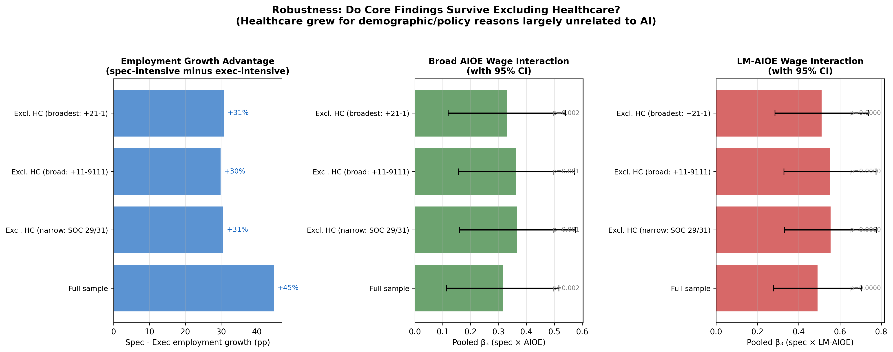

# Don't Write Off Human Labor, Yet

Empirical analysis supporting the article "Don't Write Off Human Labor, Yet", which investigates whether AI capital and human "specification labor" are complements (σ < 1) rather than substitutes.

**Core claim:** Even as AI automates execution, the irreducibly human work of *deciding what to build, for whom, and why*, or specification labor, is becoming more valuable, not less. The data suggest AI and specification labor are complements.

---

## Key Findings

### 1. The economy is shifting toward specification tasks

Management-task-intensive occupations added **+20M jobs** (2005–2024) vs **+5M** for execution-task-intensive. Decomposing that +20M: **~12M** are in occupations that score high on specification-specific tasks (staffing, resource allocation, directing) beyond what cognitive complexity alone predicts, while ~8M are driven by complexity alone.

<p align="center">
  
</p>

The pattern sharpens when crossed with AI exposure: specification-intensive occupations with high AI exposure are the **only** group gaining jobs, while execution-intensive occupations with high AI exposure lost over 60% of employment.

<p align="center">
  
</p>

### 2. AI exposure amplifies the specification wage premium

If AI and specification labor are complements (σ < 1), occupations with higher AI exposure should pay a *larger* specification premium. That is exactly what we find: the interaction coefficient β₃ is positive in all 5 cross-sections (2005–2024), with a pooled estimate of +0.315 (p = 0.002). Using language-modeling-specific AI exposure strengthens the effect (β₃ = +0.491, p = 0.009). Image generation AI shows no such pattern.

<p align="center">
  
</p>

### 3. Results are robust to excluding healthcare

Healthcare grew for demographic/policy reasons largely unrelated to AI. Excluding healthcare occupations *strengthens* the wage interaction across all definitions and both AI exposure measures, suggesting changes in the sector are not driving results.

<p align="center">
  
</p>

---

## Data Sources

| Source | What | Years |
|--------|------|-------|
| [O\*NET v29.1](https://www.onetcenter.org/) | 41 Generalized Work Activities, importance scores, ~763 occupations | Static snapshot |
| [BLS OEWS](https://www.bls.gov/oes/) | Employment and median wages by occupation | 2005, 2009, 2014, 2019, 2024 |
| [Felten et al. (2021)](https://doi.org/10.1002/smj.3286) | AI Occupational Exposure (AIOE) + Language Modeling variant | Static |
| [CPS ASEC 2024](https://www.census.gov/data/datasets/time-series/demo/cps/cps-asec.html) | Individual-level wages, employer size, occupation | 2024 |
| [Autor-Dorn task data](https://www.ddorn.net/data.htm) | DOT-based abstract/routine/manual task measures | 1977 DOT |

## Repository Structure

```
analysis/                    # All reproducible Python scripts
  phase1_data_assembly.py    # Build master panel (O*NET × OEWS × AIOE)
  spec_exec_management_contrast.py  # Define spec-exec axis, core decomposition
  generate_exhibits.py       # Article exhibits (employment shift, decomposition)
  elasticity_estimation.py   # Spec × AI interaction regressions, 3×3 tables
  elasticity_bounds.py       # Katz-Murphy, CPS microdata, diff-in-diff
  elasticity_robustness.py   # Permutation, LOO, placebo, bootstrap, LM-AIOE
  validate_pc1_complexity.py # PC1 validation against A&A 2011, Deming 2017
  robustness_exclude_healthcare.py  # Healthcare exclusion robustness
  robustness_complexity_split.py    # Above-median complexity restriction
  generate_track_a_exhibit.py       # Sigma bounds exhibit
  spec_exec_from_firm_structure.py  # CPS firm-size alternative derivation
  requirements.txt           # Python dependencies

data/                        # Raw and intermediate data
  onet/                      # O*NET v29.1 database
  ai-exposure/               # AIOE datasets (broad, LM, image generation)
  cps-asec/                  # CPS Annual Social and Economic Supplement
  crosswalks/                # SOC/Census occupation crosswalks
  autor-dorn/                # Autor-Dorn DOT task measures

output/                      # Results and documentation
  figures/                   # Generated charts
  specification_labor_findings.md   # Full findings document
  elasticity_analysis_overview.md   # Elasticity methodology and results
```

## Reproducing Results

```bash
pip install -r analysis/requirements.txt

# Core pipeline (run in order)
python analysis/phase1_data_assembly.py
python analysis/spec_exec_management_contrast.py
python analysis/generate_exhibits.py
python analysis/elasticity_estimation.py
python analysis/elasticity_bounds.py

# Robustness checks (independent, any order)
python analysis/elasticity_robustness.py
python analysis/validate_pc1_complexity.py
python analysis/robustness_exclude_healthcare.py
python analysis/robustness_complexity_split.py
python analysis/generate_track_a_exhibit.py
```

## Methodology

**Defining specification vs execution:** We contrast management occupations (SOC 11-XXXX, n=33) against all others on 41 O\*NET Generalized Work Activities. The management profile correlates R² = 0.905 with PC1 (cognitive complexity, validated at r = +0.85 against [Acemoglu & Autor 2011](https://economics.mit.edu/sites/default/files/publications/Skills,%20Tasks%20and%20Technologies%20-%20Implications%20for%20.pdf) exact NRC task measures). We residualize to isolate specification-specific tasks: staffing, resource allocation, directing, selling — the tasks that survive after removing what's explained by general cognitive complexity.

**Testing complementarity:** Under CES production, if σ(AI, spec labor) < 1, occupations with higher AI exposure should pay a larger specification premium. We test this with cross-sectional wage regressions across 5 time periods, finding β₃ positive in all years, significant under permutation (p = 0.009) and cluster bootstrap (CI excludes zero).

**Employment weighting:** The wage interaction is estimated with employment weights — the correct specification for a labor-market-level question. The result survives permutation inference, leave-one-out (100% positive across all 754 occupations), and placebo task axes (100th percentile), confirming it is not driven by any single occupation or arbitrary measurement choice.

**Limitations:** We have no IV strategy. AI adoption is 2–3 years old, so effects are early-stage. See `output/elasticity_analysis_overview.md` for full discussion.

## References

- Acemoglu, D. and D. Autor (2011). "Skills, Tasks and Technologies." *Handbook of Labor Economics* 4B.
- Autor, D. (2022). "From Unbridled Enthusiasm to Qualified Optimism to Vast Uncertainty." NBER WP 30074.
- Autor, D. et al. (2024). "New Frontiers: The Origins and Content of New Work." *QJE* 139(3).
- Deming, D. (2017). "The Growing Importance of Social Skills." *QJE* 132(4).
- Felten, E., M. Raj, R. Seamans (2021). "Occupational Exposure to AI." *SMJ* 42(12).
- Korinek, A. and J. Suh (2024). "Scenarios for the Transition to AGI." NBER WP 32152.
- Oberfield, E. and D. Raval (2021). "Micro Data and Macro Technology." *Econometrica* 89(2).
